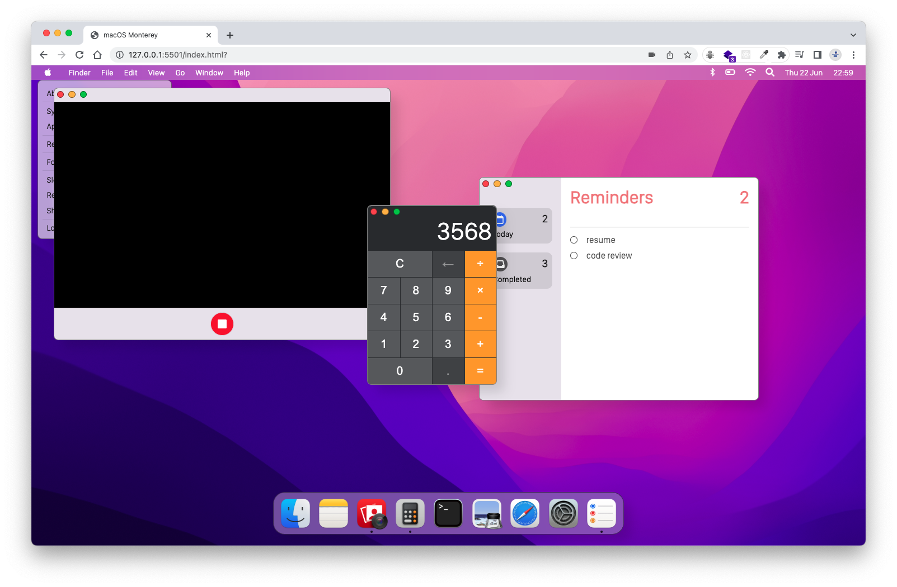

# MacOS Monterey GUI Clone Project

This project is a web-based clone of the **_[MacOS Monterey](<(https://www.apple.com/by/macos/monterey/)>)_** user interface. It is implemented using HTML, SCSS, and JavaScript.

## Features

- **Menu Bar**: The menu bar includes the Apple brand icon, which can be hovered over to reveal selectable sub-menus.
- **Date and Time**: The date and time displayed on the interface are updated every second to reflect the current time.
- **Dock with Working Applications**: The dock includes three working applications represented by icons. Each working application has a dot below it to indicate that can be opened. The applications in the dock are as follows:
  - **Photo Booth**: This application allows access to the web browser's camera functionality.
  - **Calculator**: The calculator application provides a user interface with digit buttons for input and supports basic arithmetic operations for calculation.
  - **Reminders**: The reminders application enables users to input reminders and displays them on the screen. It also tracks the total number of to-dos and completed tasks.
- **Shared Modal Element**: All three applications can be opened and displayed using a shared modal element, providing a consistent user experience.
- **Draggable Window**: The modal element is draggable, providing users with the ability to move the modal window around the screen.
- **LocalStorage Integration**: The reminders application utilises the browser's localStorage to store the user's to-do list.

Feel free to explore this project to get a glimpse of the MacOS Monterey user interface implemented in a web-based environment.

## Screenshot

